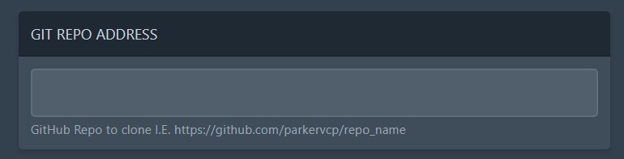
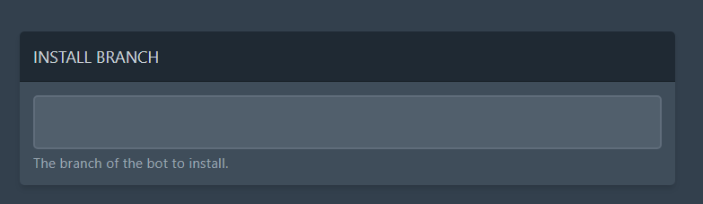
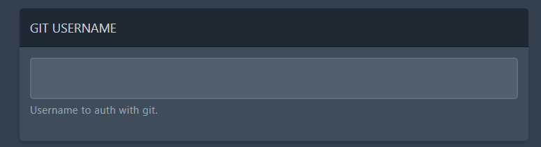
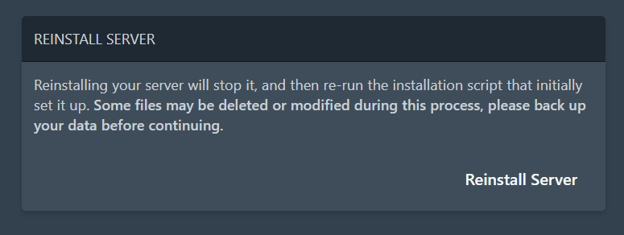

# Cloning a Git repository on your server


If you are having trouble cloning from a Git repository you can always download the files to your PC then upload them to the server.


To clone a Git repository on to your server you must configure the repository in the startup tab.

The first thing you must set is the repository address:\

<figure><figcaption></figcaption></figure>

This is the URL that your repository is at, e.g. https://github.com/yourname/reponame.

Next you must set the install branch, for most people this is probably `master`. This is the production branch of your repository that should be pulled.\

<figure><figcaption></figcaption></figure>

**If you repository is a private repository you must fill in the following variables**

You must enter your username on the Git host in the Git username variable:\

<figure><figcaption></figcaption></figure>

And then you must enter your personal access token. Depending on the site you use to host your repository this can be found at the following links:

* [GitHub](https://github.com/settings/tokens)
* [GitLab](https://gitlab.com/-/profile/personal_access_tokens)

If you use a different service to host your repository you must create a personal access token with them.

**Finally...**

You must trigger the cloning so your server can pull from the repository every time it restarts. To do this firstly make sure there are no files on your server then on the settings page of your server click `Reinstall Server`.\

<figure><figcaption></figcaption></figure>

Your repository should then clone!
