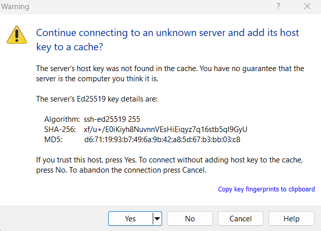

# Connecting to your server's files with SFTP

You can use an SFTP client to connect to your server on bot-hosting.net and manage it's files.

### Downloading an SFTP client 

The first thing you will need to do is download an SFTP client, which is used for connecting to the SFTP server and managing the files. This guide will use screenshots from WinSCP, but you can also use FileZilla. Download links:

* [WinSCP](https://winscp.net/eng/download.php) (Windows only)
* [FileZilla](https://filezilla-project.org/download.php?type=client)

Once downloaded, install the client you have chosen.

### Getting your SFTP connection details 

To connect to the SFTP server you will need your connection details. On the control panel, go on the settings tab of your server.\
\

<figure><figcaption></figcaption></figure>

If you have an SFTP client installed you can click `Launch SFTP` and it will start your SFTP client with the details entered.

If your SFTP client does not launch for whatever reason, you can always start it yourself and copy and paste the connection details in (remember the number after the `:` at the end is the port, and the bit before it is the host, i.e. in this example `example.bot-hosting.net` is the host and `2022` is the port).

You will then need to get your SFTP password, which can be generated on the [settings page](https://bot-hosting.net/panel/settings) of the client panel.

Once all the details have been entered, you can connect. You may be prompted to accept the server's keys with a warning that you haven't connected to this server before, in which case you should click yes. The warning may look as follows:\

<figure><figcaption></figcaption></figure>

You should then connect and be able to manage your files, being able to copy files over from your PC and use the upload & download functions.
