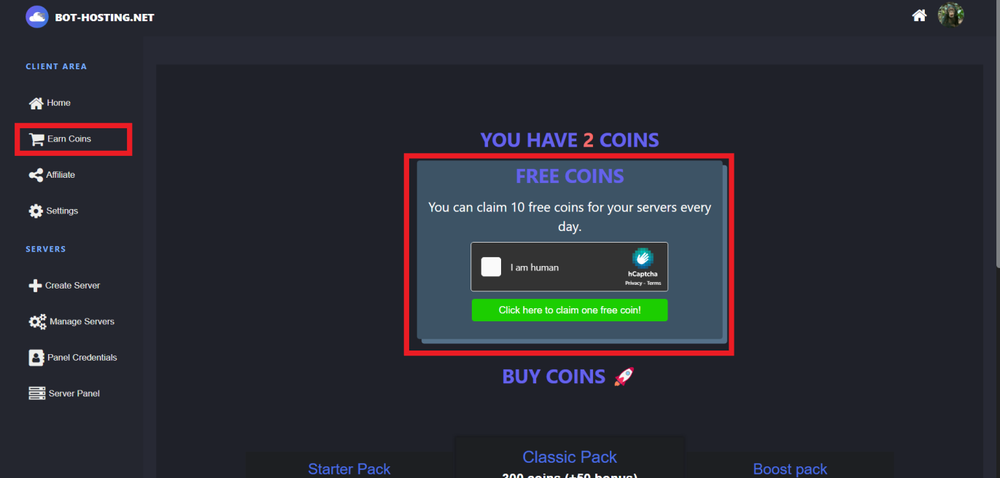
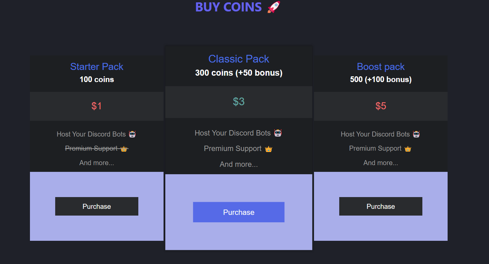
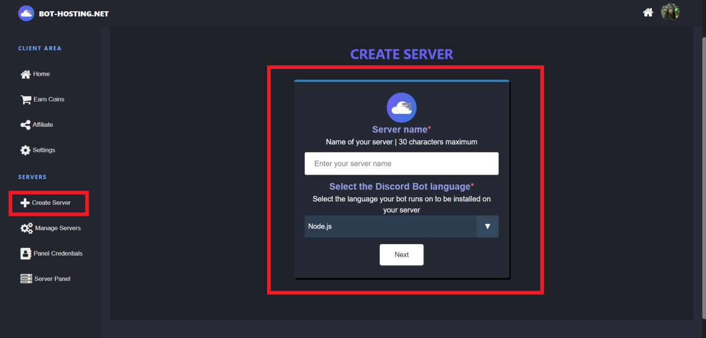
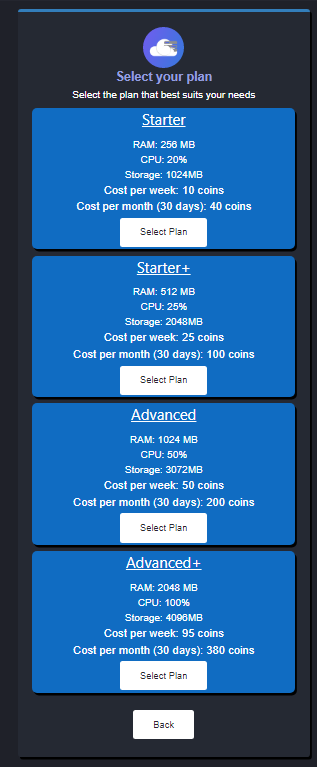
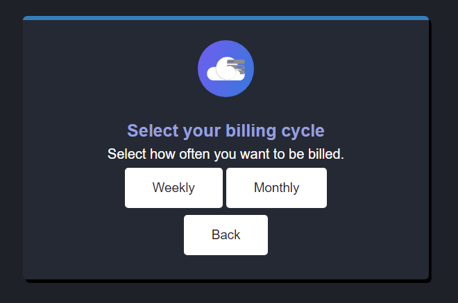
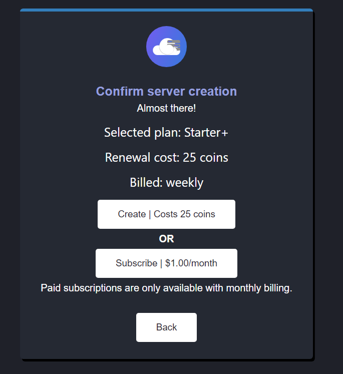
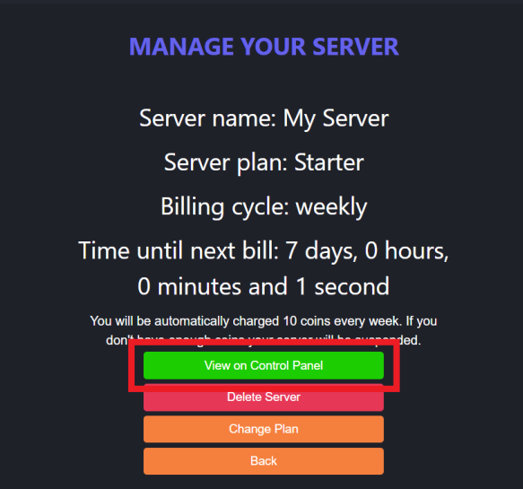
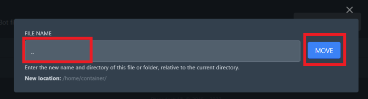

# Hosting your first bot

**Contents:**

[Coins](https://wiki.bot-hosting.net/guides/hosting-your-first-bot#coins) - The coins system explained

[Creating the server ](https://wiki.bot-hosting.net/guides/hosting-your-first-bot#creating-the-server)- How to create your server

[Setting up your server ](https://wiki.bot-hosting.net/guides/hosting-your-first-bot#setting-up-your-server)- How to upload and run your code

To start with you must login at [https://bot-hosting.net/login](https://bot-hosting.net/login) with Discord. Your account will be linked to all your servers.

## Coins 

Bot-hosting uses a coin system, servers cost a certain amount of coins every week/month, so you need coins to create your server and keep it running.\
\
There are two ways to get coins, both can be accessed on the earn coins page.

<figure><figcaption></figcaption></figure>

The first way to earn coins is using the free coin generator, every user is able to claim 10 coins completely for free. The generator can be found at the top of the earn coins page. You must complete the captcha and then click the button labelled `Click here to claim one free coin!`. You can do this 10 times every day.\

<figure><figcaption></figcaption></figure>

Alternatively you can purchase coins with money. This may be required if your bot requires more resources.

## Creating the server 

You should select `Create Server` on the navbar down the side. You will see a page where you can enter your server requirements.

You will first be prompted for a name and language. The name is what you want the server to be referred to as, this is for you to help identify it if you have multiple servers. The language is the programming language that your bot was coded in. You must select the correct language so the server is compatible with your bot. **Please note:** We have had multiple users confuse Java with Node.js, JavaScript and Java are completely different languages.\
\
You should click next once you have filled in these details.

<figure><figcaption></figcaption></figure>

You will then be asked to select a plan, each plan comes with different server specifications. Depending on the complexity of your bot, intensity of the tasks your bot performs and the amount of servers your bot is in you will need to select a suitable plan. You can always change your plan again later on.

You can view the price of the plans, this is how many coins you will have to pay either every week or every month.\
\
\

<figure><figcaption></figcaption></figure>

You will then be prompted to select your billing cycle. This is how often you will be charged coins. Your options are either weekly or monthly. For most people weekly is more ideal as it enables more flexibility with servers however others may prefer to see their coins billed once a month.

In the end, whatever you choose isn't that important so choose whichever you'd prefer.\

<figure><figcaption></figcaption></figure>

Finally you will have to confirm creation. Alternatively you will have the option to subscribe to a paid subscription where coins are not involved.\
\

<figure><figcaption></figcaption></figure>

Once you confirm creation your server will be created and the installation process will be initiated!

## Setting up your server 

Now that you have created a server, you should be able to view it on the `Manage Servers` page. You can click manage server on it.\
\

<figure><figcaption></figcaption></figure>

You can then view your server on the control panel, this is where you will upload files, start/stop your server and configure it.\
\

<figure><figcaption></figcaption></figure>

If this is your first time entering the control panel, you will be prompted to login with Discord again

Once logged in you should then be able to see your server on the control panel. You can select it.\
\

<figure><figcaption></figcaption></figure>

You should now see your server like this. As you can see along the top you have a lot of tabs to control different aspects of the server. The first thing you should do is upload your files.

There are two ways to upload your files, either in the files tab or if you are uploading lots of files or want to integrate file uploads in to your deployment system you can use the file upload protocol, SFTP. If you wish to use SFTP you can find your credentials on the settings page in the control panel navbar for your server.

If you wish to upload your files using the files tab and file selector, click files in the navbar along the top of your server and then click upload. You should upload your files in a compressed format such as `.zip` or `.gz` or any other compression format. Then when it's on the server click the 3 dots next to the file and click `Unarchive` to extract it.\
\
\

<figure><figcaption></figcaption></figure>

Your files will most likely decompress in to a folder, you should move your files out of the folder, doing this is easy. First click open the folder you just extracted the files in to.\
\

<figure><figcaption></figcaption></figure>

Then select all the files, using the check box next to them, you should now see a menu appear on your server, where you can click `Move`.\
\

<figure><figcaption></figcaption></figure>

This will open a modal where you can enter the path to move the files to, you can enter a relative path here so to move the files out of the folder simply enter `..` to move them back one directory. Then to complete the move simply press enter or click the move button.\
\

<figure><figcaption></figcaption></figure>

Finally you can delete the archive and folder on your server to free up space.

### **Final Configuration**

You should ensure the start-up configuration (found in the `Startup` tab on your server control panel) before your bot is good to go. There are some notable configuration options.

You will see an option similar to `Bot <language> file` or `JAR FILE` or similar. This is the file that the server will start with. When developing your bot, you will have a main file that is used to start the code and import all other files, this is what you must enter here and make sure it is correct.\
\

<figure><figcaption></figcaption></figure>

Additionally, if you are running a python or node.js server, you need to make sure you tell the server all modules (packages/libraries) that your code requires to be installed.

For node.js if you simply upload your `package.json` file, which should be generated when you installed the packages in your development environment, the server will use it to install all required dependencies.

For python you can either upload a `requirements.txt` file containing all modules to be installed or in the startup tab under `Additional Python packages` you can enter all modules you require with a space between them.

Your server should now be good to go!
